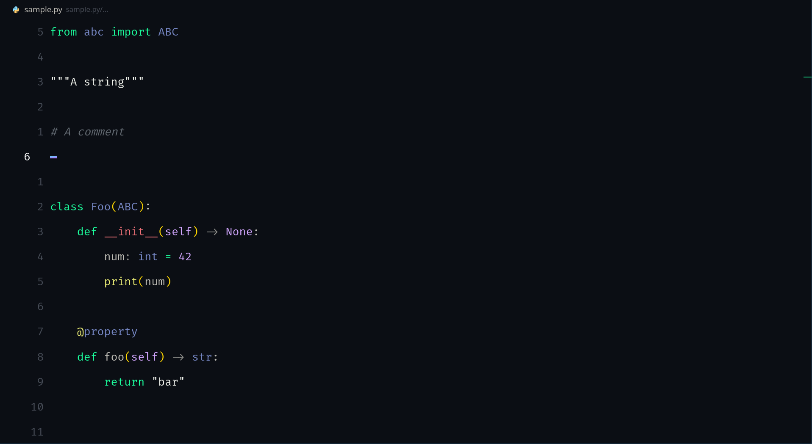

<h1 style="color: green">GreenLanX</h1>

###### A sleek, dark VS Code theme with green highlights, ideal for low-light coding environments.

<h2 style="color: green">Screenshot</h2>

<h2 style="color: green">Installation</h2>

